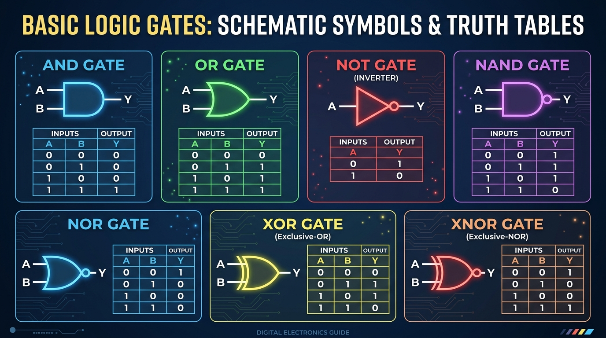
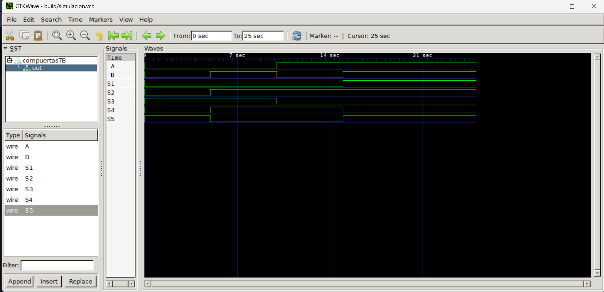
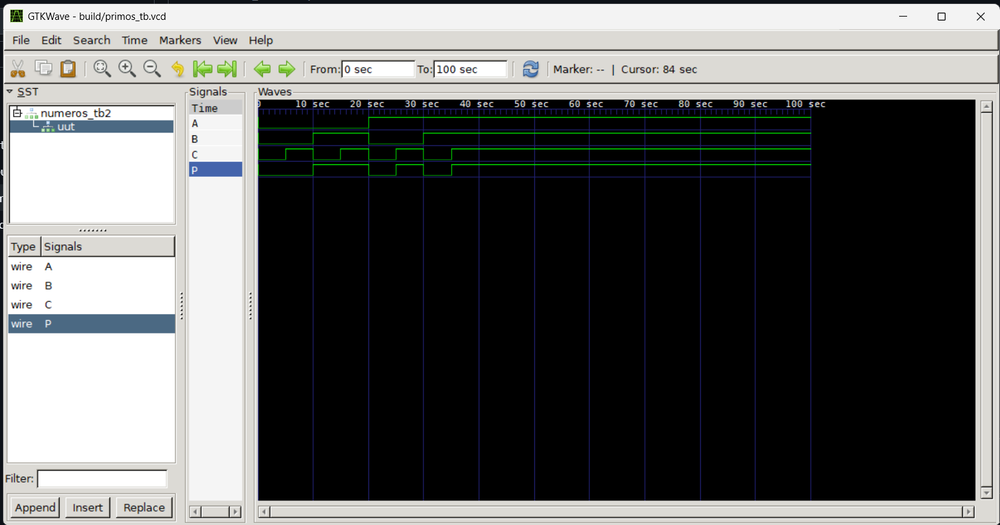

# Lab01 - Introducción a la lógica combinacional

## Integrantes
  * [Andres Mateo Arias Aguilera](https://github.com/mateoaeora124)
  * Gabriel Cangrejo
  * Cesar Alberto Gomez
## informe

## Índice
1. [Introducción](#1-introducción)
2. [Simulación](#2-simulación)
   * [2.1 Parte 1: Compuertas Lógicas](#2.1-parte-1-compuertas-lógicas)
   * [2.2 Parte 2: Detector de Números Primos (3 bits)](#2.2-parte-2-detector-de-números-primos-3-bits)
   * [2.3 Parte 3: Sumador Completo de 1 Bit](#2.3-parte-3-sumador-de-1-bit)
3. [Evidencias](#3-evidencias)
4. [Guías Interactivas](#4-guías-interactivas)
5. [Conclusiones](#5-conclusiones)
6. [Referencias](#6-referencias)

## 1. Introducción

### 1.1 Compuertas lógicas

#### Descripción

En este apartado se introducen los conceptos fundamentales de las **compuertas lógicas** y sus principios de funcionamiento. La comprensión de estos elementos teóricos es indispensable para validar y analizar las simulaciones de los circuitos digitales desarrolladas en las secciones posteriores de este laboratorio.
de esta manera podemos encontrar las siguientes compuertas lógicas básicas, las cuales son la base de la lógica de todo circuito digital:

---




---

### 1.2 Clasificación y Descripción de Compuertas Lógicas

* **AND (Y Lógica):** Entrega un nivel alto (`1`) en su salida únicamente cuando todas sus entradas se encuentran en nivel alto. Realiza la multiplicación booleana ($Y = A \cdot B$).
* **OR (O Lógica):** Entrega un nivel alto (`1`) si al menos una de sus entradas se encuentra en nivel alto. Realiza la suma booleana ($Y = A + B$).
* **NOT (Inversor):** Posee una sola entrada e invierte el estado lógico recibido ($Y = \bar{A}$).
* **NAND (NO-Y):** Salida equivalente a una compuerta AND seguida de un inversor. Su salida es nivel bajo (`0`) únicamente cuando todas sus entradas son altas ($Y = \overline{A \cdot B}$). Es una compuerta universal.
* **NOR (NO-O):** Salida equivalente a una compuerta OR seguida de un inversor. Su salida es nivel alto (`1`) únicamente cuando todas sus entradas son bajas ($Y = \overline{A + B}$). Es una compuerta universal.
* **XOR (O Exclusiva):** Entrega un nivel alto (`1`) en su salida únicamente cuando sus entradas presentan estados lógicos diferentes entre sí ($Y = A \oplus B$).
* **XNOR (NO-O Exclusiva):** Entrega un nivel alto (`1`) únicamente cuando sus entradas presentan estados lógicos iguales ($Y = \overline{A \oplus B}$).

---

### 1.3 Representación Operacional en Código y Álgebra Booleana

Para la descripción e implementación digital en lenguajes de programación y de descripción de hardware (HDL), las operaciones lógicas se representan mediante los siguientes operadores:

| Compuerta | Función Booleana | Operador Verilog | Operador (primitivas) VHDL |
| :--- | :---: | :---: | :---: |
| **AND** | $A \cdot B$ | `&` | `and` |
| **OR** | $A + B$ | `\|` | `or` |
| **NOT** | $\bar{A}$ | `~` | `not` |
| **NAND** | $\overline{A \cdot B}$ | `~(A & B)` | `nand` |
| **NOR** | $\overline{A + B}$ | `~(A \| B)` | `nor` |
| **XOR** | $A \oplus B$ | `^` | `xor` |
| **XNOR** | $\overline{A \oplus B}$ | `~(A ^ B)` | `xnor` |

## 2. Simulación

En este apartado se presenta la descripción en hardware mediante **Verilog** y la simulación funcional de los tres módulos requeridos.

## #2.1 parte 1 compuertas lógicas
Se realiza la descripción en Verilog de las compuertas lógicas mediante **primitivas** y **descripción estructural/comportamental**, mediante el uso de un test bench y apoyo con gtk wave comprobando su comportamiento frente a las tablas de verdad correspondientes, descritas en la seccion de introduccion.

1. **Módulo de Compuertas (`ejercicio2_.v`)**
   
```verilog
module compuertas (
input A,
input B,
output S1,
output S2,
output S3,
output S4,
output S5
);

and (S1, A, B);
or (S2, A, B);
not (S3, A);
xor (S4, A, B);
xnor (S5, A, B);
endmodule
```
2. **Testbench (`ejercicio2_TB.v`)**
```verilog
`include "ejercicio2_.v"
`timescale 1s/1s
module compuertasTB(

);

reg A_TB;
reg B_TB;
wire S1_TB;
wire S2_TB;
wire S3_TB;
wire S4_TB;
wire S5_TB;

compuertas uut (
.A(A_TB),
.B(B_TB),
.S1(S1_TB),
.S2(S2_TB),
.S3(S3_TB),
.S4(S4_TB),
.S5(S5_TB)
);

initial begin
//caso de prueba 1
A_TB = 1'b0;
B_TB = 1'b0;
#5;
//caso de prueba 2
A_TB = 1'b0;
B_TB = 1'b1;
#5;  
//caso de prueba 3
A_TB = 1'b1;
B_TB = 1'b0;
#5;
//caso de prueba 4
A_TB = 1'b1;
B_TB = 1'b1;
#5;
end

initial begin: TEST_CASE
$dumpfile("simulacion.vcd");
$dumpvars(-1, uut);
#25 $finish;
end
endmodule
```
#### Verificación y Resultados en GTKWave

Para visualizar la forma de onda de la simulación, se ejecuta el siguiente comando en la terminal integrada de Visual Studio Code:

```teminal
gtkwave build/simulacion.vcd
```
obteniendo asi el siguiente resultado:
---



---
## #2.2 parte 2 detector de números primos 3 bits

En esta sección se diseña e implementa un circuito combinacional capaz de detectar si un número binario de 3 bits ($N = ABC, rango de $0$ a $7$) corresponde a un número primo. 

#### Análisis Teórico y Tabla de Verdad
Considerando la secuencia de 3 bits, los números evaluados son: $0, 1, 2, 3, 4, 5, 6, 7$. Por definición, los números primos en este rango son **2, 3, 5 y 7**.

| Entrada ($A B C$) | Valor Decimal | Es Primo? | Salida ($P$) |
| :---: | :---: | :---: | :---: |
| 000 | 0 | No | 0 |
| 001 | 1 | No | 0 |
| 010 | 2 | Sí | 1 |
| 011 | 3 | Sí | 1 |
| 100 | 4 | No | 0 |
| 101 | 5 | Sí | 1 |
| 110 | 6 | No | 0 |
| 111 | 7 | Sí | 1 |

#### Obtención de la Ecuación Booleana por Mintérminos

A partir de la tabla de verdad, identificamos las combinaciones donde la salida $P = 1$ para expresar la función en su **Suma de Productos (SOP)** utilizando la notación de mintérminos ($\Sigma m$):

$$Input(A, B, C) = \sum p(2, 3, 5, 7)$$

Expandiendo cada mintérmino a partir de las variables de entrada:

$$P = \bar{A}B\bar{C} + \bar{A}BC + A\bar{B}C + ABC$$

Alineando e identificando términos comunes para la simplificación booleana:

1. Factorizando $\bar{A}B$ de los primeros dos términos ($p_2$ y $p_3$):
   
   $$\bar{A}B(\bar{C} + C) = \bar{A}B(1) = \bar{A}B$$

3. Factorizando $AC$ de los últimos dos términos ($p_5$ y $p_7$):
   
   $$AC(\bar{B} + B) = AC(1) = AC$$

**Ecuación Simplificada Resultante:**

$$P = \bar{A}B + AC$$


**Representación de circuito digital resultante**


---


#### Código en Verilog

1. **Módulo Detector de Primos (`primos.v`)**
```verilog

module primos(
    input A,
    input B,
    input C,
    output P
);

 // Ecuación directa: P = (~A & B) | (A & C)
wire not_a;
    wire term1; // Guarda el resultado de (~A y B)
    wire term2; // Guarda el resultado de (A y C)

    // Compuertas
assign P = (~A & B) | (A & C);

endmodule

```
2. **Testbench (`primos_TB.v`)**
```verilog
`include "primos.v"
`timescale 1s/1s

module numeros_tb2(

);
reg A_TB;
reg B_TB;
reg C_TB;
wire P_TB;

primos uut (
    .A(A_TB),
    .B(B_TB),
    .C(C_TB),
    .P(P_TB)
);


    initial begin
        // Inicializa las entradas
        //PRIMO 0
A_TB = 1'b0;
    B_TB = 1'b0;
    C_TB = 1'b0;
    #5;

    // Número 1 (P = 0)
    A_TB = 1'b0;
    B_TB = 1'b0;
    C_TB = 1'b1;
    #5;

    // Número 2 - Primo (P = 1)
    A_TB = 1'b0;
    B_TB = 1'b1;
    C_TB = 1'b0;
    #5;

    // Número 3 - Primo (P = 1)
    A_TB = 1'b0;
    B_TB = 1'b1;
    C_TB = 1'b1;
    #5;

    // Número 4 (P = 0)
    A_TB = 1'b1;
    B_TB = 1'b0;
    C_TB = 1'b0;
    #5;

    // Número 5 - Primo (P = 1)
    A_TB = 1'b1;
    B_TB = 1'b0;
    C_TB = 1'b1;
    #5;

    // Número 6 (P = 0)
    A_TB = 1'b1;
    B_TB = 1'b1;
    C_TB = 1'b0;
    #5;

    // Número 7 - Primo (P = 1)
    A_TB = 1'b1;
    B_TB = 1'b1;
    C_TB = 1'b1;
    #5;

    // Finaliza la simulación
end
    initial begin:TEST_CASE
    $dumpfile("primos_tb.vcd");
    $dumpvars(-1, uut);
    #100 $finish;
    end
endmodule
```
#### Verificación y Resultados en GTKWave

Para visualizar la forma de onda de la simulación, se ejecuta el siguiente comando en la terminal integrada de Visual Studio Code:

```teminal
gtkwave build/primos_tb.vcd
```
obteniendo asi el siguiente resultado:

---



---
##  #2.3 parte 3 sumador de 1 Bit 

Un sumador de 1 bit es un circuito combinacional que realiza la suma aritmética de tres bits de entrada: dos operandos ($A$ y $B$) y un acarreo de entrada ($C_{in}$). Entrega dos salidas: la suma ($S$) y el acarreo resultante de la operación ($C_{out}$).

#### Análisis Teórico y Tabla de Verdad

| Entrada $A$ | Entrada $B$ | Acarreo Ent. ($C_{in}$) | Suma ($S$) | Acarreo Sal. ($C_{out}$) |
| :---: | :---: | :---: | :---: | :---: |
| 0 | 0 | 0 | 0 | 0 |
| 0 | 0 | 1 | 1 | 0 |
| 0 | 1 | 0 | 1 | 0 |
| 0 | 1 | 1 | 0 | 1 |
| 1 | 0 | 0 | 1 | 0 |
| 1 | 0 | 1 | 0 | 1 |
| 1 | 1 | 0 | 0 | 1 |
| 1 | 1 | 1 | 1 | 1 |

#### Ecuaciones Booleanas por Mintérminos

A partir de la tabla de verdad, deducimos las expresiones en **Suma de Productos (SOP)** para cada salida:

1. **Ecuación para la Suma ($S$):**

$$S(A, B, C_{in}) = \sum m(1, 2, 4, 7)$$

$$S = \bar{A}\bar{B}C_{in} + \bar{A}B\bar{C}_{in} + A\bar{B}\bar{C}_{in} + ABC_{in}$$

Simplificando mediante operaciones XOR ($\oplus$):

$$S = A \oplus B \oplus C_{in}$$

2. **Ecuación para el Acarreo de Salida ($C_{out}$):**

$$C_{out}(A, B, C_{in}) = \sum m(3, 5, 6, 7)$$

$$C_{out} = \bar{A}BC_{in} + A\bar{B}C_{in} + AB\bar{C}_{in} + ABC_{in}$$

Simplificando mediante álgebra booleana:

$$C_{out} = (A \oplus B)C_{in} + AB$$

---

#### Código en Verilog

1. **Módulo Sumador (`sumador.v`)**
```verilog
// Pega aquí el código del módulo del sumador completo de 1 bit

